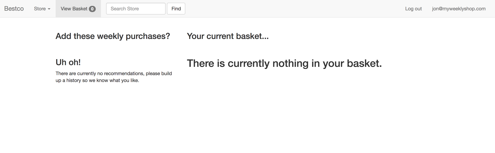
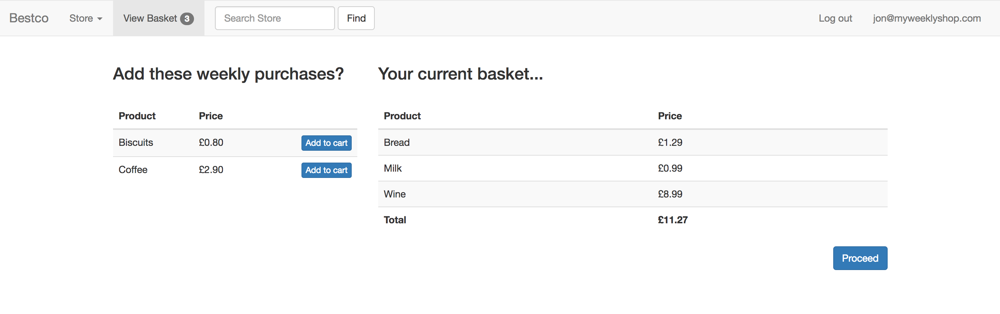

# Basket Recommendation application

<b>Description: </b>The purpose of this application was to recreate a singular (<em>interesting</em>) piece of functionality from a web based shopping cart. The functionality replicated - albeit to a basic level - is cart recommendations based on a customers spending habits. More specifically, products are recommended to the customer on the 'view basket' page if they have purchased that product at least once a week, for the previous 2 consecutive weeks.

App uses Rails with a Bootstrap front end.

### Set up stages
- Ensure Ruby/Rails is installed,
- Clone the Repo and cd into it,
- Run `bundle install`
- Run `rails db:create`, then `rails db:migrate`, then `rails db:seed`
- Start the Rails server (`rails s`)
- Open your browser and head to http://localhost:3000/

### Tests
Tests cover both models/methods (using Rspec) and page functionality (using Capybara). To view tests run `rspec` in the file root.

### Files of interest
- Basket recommendation logic > `app/models/item.rb`
- Front end view > `app/views/baskets/index.html.erb`
- Tests > `spec/...`
- DB seed file > `db/seeds.rb`

### Points to consider / Future development
- Recommend logic does not currently take into account what is already in customer basket.
- Currently only uses last two purchase dates for each product to check eligibility for recommendation. Would be more effective with a full history check.
- 'Add to basket' button alongside recommendation needs to be properly linked to pass product into Basket table once selected.

### App images
Before the DB is seeded with Basket items, and purchase history items that meet recommend criteria.

And with items added.

 
